# Tutorial: Configuración de Servidor DHCP en Debian y Clientes DHCP en Windows y Ubuntu

## Introducción
Este tutorial cubre la instalación y configuración de un servidor DHCP en Debian y la configuración de dos clientes DHCP (uno con Windows y otro con Ubuntu) en una red privada. Se detallan los pasos para configurar el servidor DHCP, los clientes, y las pruebas necesarias para verificar la correcta asignación de las direcciones IP y otros parámetros.

---

## Preparación del Entorno

1. **Crear las máquinas virtuales**:
   - Utiliza VirtualBox para crear las siguientes máquinas:
     - **Debian**: Servidor DHCP.
     - **Windows**: Cliente DHCP.
     - **Ubuntu**: Cliente DHCP.
   - Todas las máquinas deben estar en la misma subred interna **SRI2XX** con la red 10.0.XX.0/24.
   
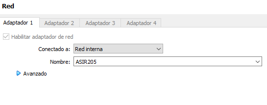

2. **Configurar el router pfSense**:
   - Configura el router pfSense como puerta de enlace y asegúrate de desactivar su servidor DHCP en la interfaz interna.
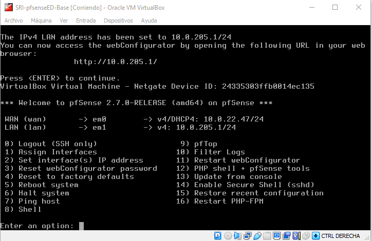
   - Verifica que las máquinas Debian, Windows y Ubuntu puedan acceder a Internet antes de continuar con la configuración del servidor DHCP.

    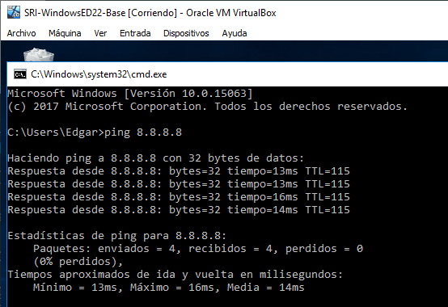

    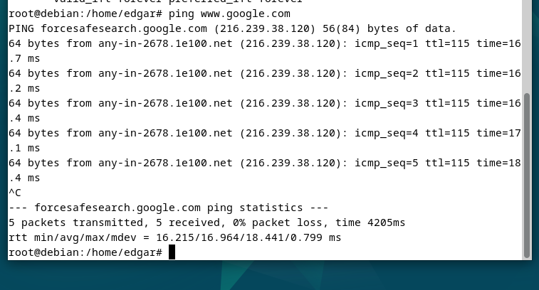
    
---

## Ejercicio 1: Configuración del Servidor DHCP en Debian

- Instalación del Servidor DHCP en Debian

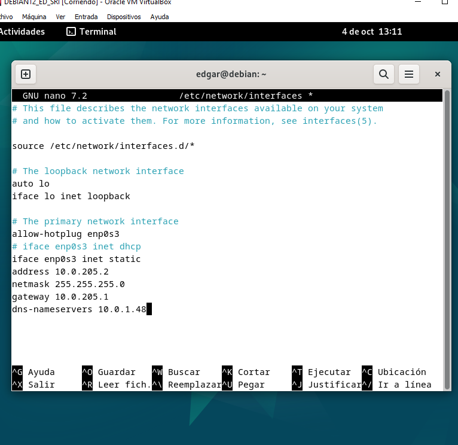

1. Abre una terminal en la máquina Debian e instala el servidor DHCP:
   ```bash
   sudo apt update
   sudo apt install isc-dhcp-server
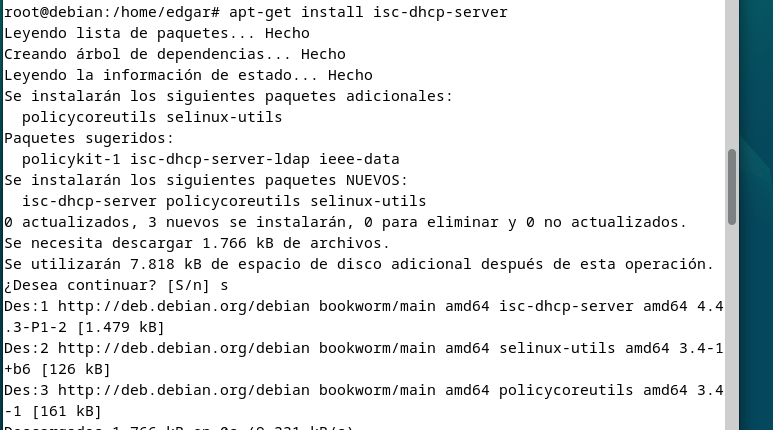
1. Verifica que el paquete se ha instalado correctamente:

sudo systemctl status isc-dhcp-server

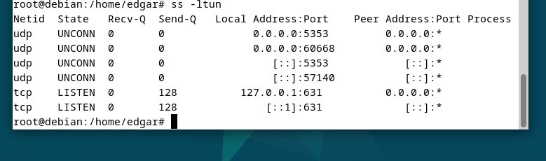

- Configuraciones adicionales
Hacemos una copia de seguridad:

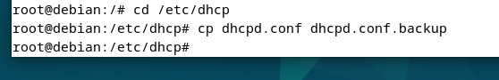

1. Edita el archivo de configuración principal /etc/dhcp/dhcpd.conf para definir la red y el rango de IPs:

sudo nano /etc/dhcp/dhcpd.conf

5. Añade la siguiente configuración:

 **Configuraciones necesarias**
- Rango de IPs: Asegúrate de configurar el rango para las direcciones IP de los clientes:
- range 10.0.XX.1 10.0.XX.100;
- Máscara de subred: La máscara por defecto es 255.255.255.0.
- Puerta de enlace: Configura la dirección de la puerta de enlace que corresponde a tu red:
- option routers 10.0.XX.1;
- Servidores DNS:
- Preferido: DNS del instituto (consulta a tu administrador para obtenerlo).
-Alternativo: Utiliza el DNS de Google 8.8.8.8.
- Sufijo DNS:
- option domain-name "sriXX.local";
Reserva de IP para el cliente Ubuntu:

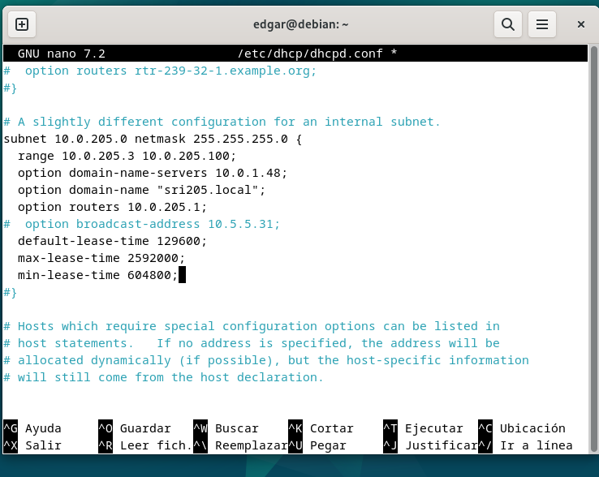

- Añade la siguiente reserva en el archivo /etc/dhcp/dhcpd.conf:

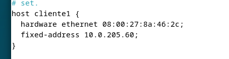

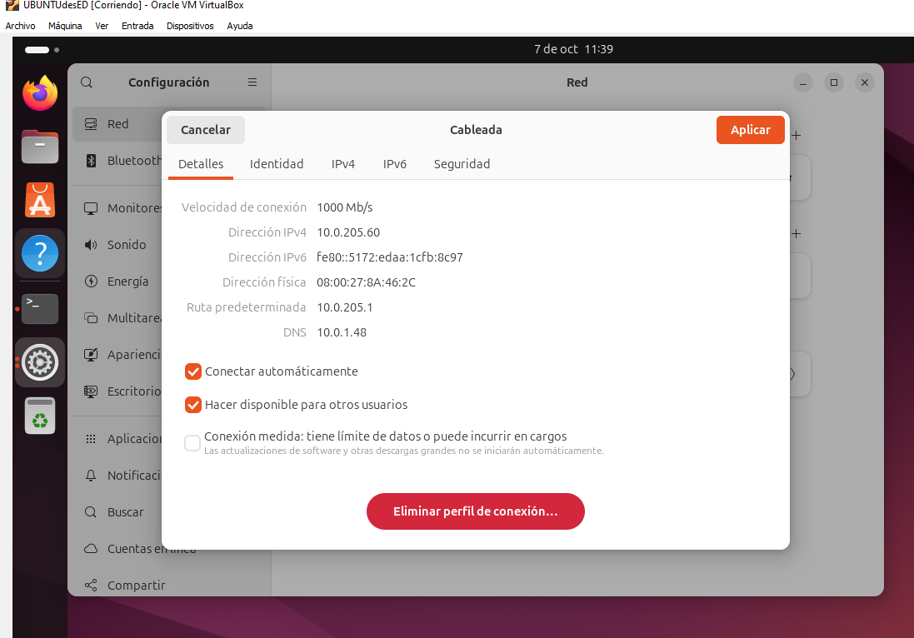

- host ubuntu-client {
    hardware ethernet 00:11:22:33:44:55;  # Cambia la MAC por la correcta
    fixed-address 10.0.XX.60;
}
Tiempos de alquiler:
Tiempo por defecto: 15 días (1296000 segundos).
Máximo: 30 días (2592000 segundos).
Mínimo: 1 semana (604800 segundos).

**Reiniciar el servicio y verificar que está activo**
Reinicia el servidor DHCP:

sudo systemctl restart isc-dhcp-server

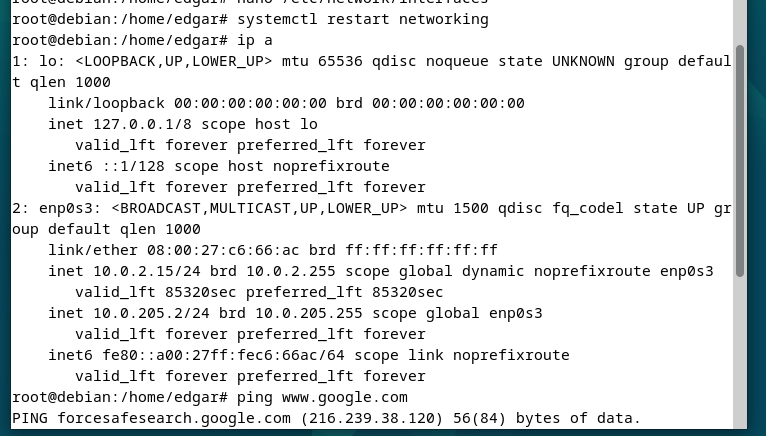

Verifica el estado del servicio:


sudo systemctl status isc-dhcp-server

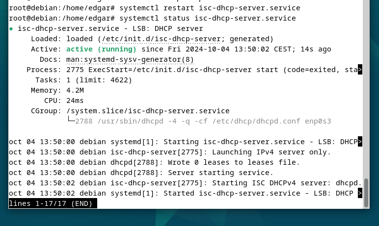

## Ejercicio 2: Configuración de los Clientes DHCP
1. **Configuración de los clientes DHCP**
- Cliente Windows:

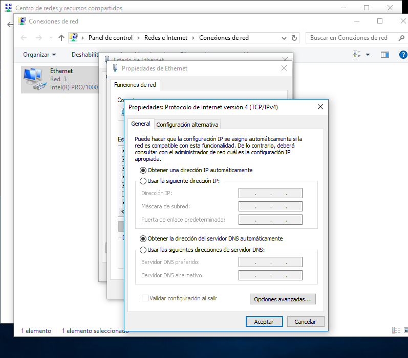

1. **En la configuración de red, selecciona la opción para obtener la dirección IP automáticamente.**
- Haz clic derecho sobre el adaptador de red, selecciona "Propiedades", y luego en "Protocolo de Internet versión 4 (TCP/IPv4)", marca la opción "Obtener una dirección IP automáticamente" y "Obtener la dirección del servidor DNS automáticamente".
Cliente Ubuntu:


**a.Verificar las IPs asignadas**
En el servidor Debian, revisa el archivo de concesión de direcciones IP para ver qué IPs han sido asignadas:

cat /var/lib/dhcp/dhcpd.leases

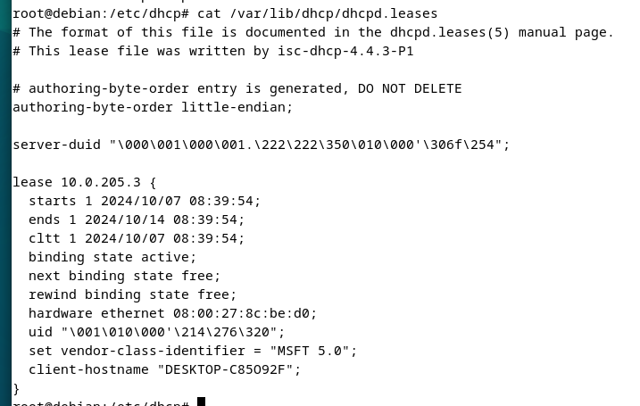

**b.Verificar los parámetros en los clientes**
Cliente Windows:

Usa el comando ipconfig /all en el símbolo del sistema para verificar:
IP asignada.
Máscara de subred.
Puerta de enlace.
DNS primario y alternativo.
Nombre de dominio.

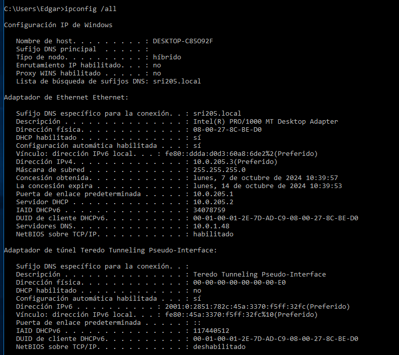

Cliente Ubuntu:

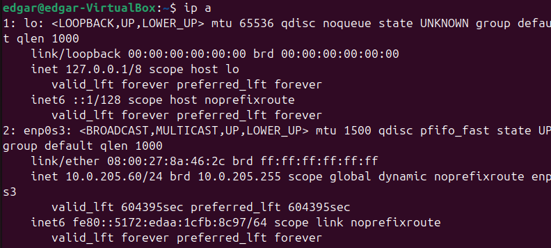

Usa el comando ifconfig o ip a para verificar la IP.
Usa el comando nmcli dev show para revisar los parámetros de red.

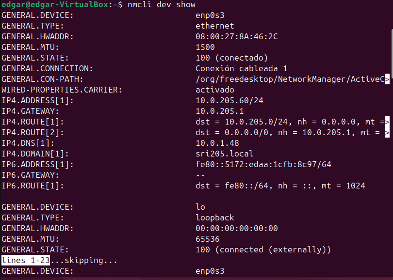

**d.Verificar conectividad**
Verifica la conectividad con una prueba de ping:

Desde Windows, ejecuta:

- ping 10.0.XX.1

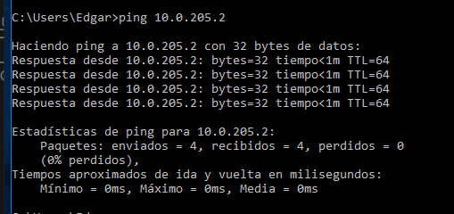

Desde Ubuntu, ejecuta:

- ping 10.0.XX.1

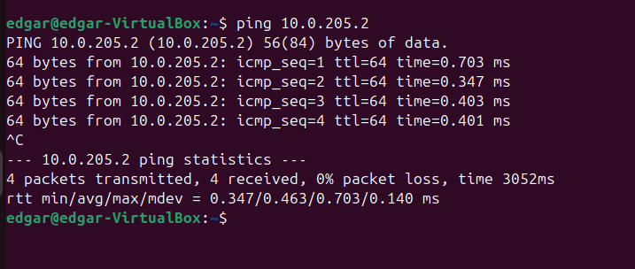

**Asegúrate de que ambos equipos tienen acceso a Internet.**

## Ejercicio 3: Funcionamiento del Servidor DHCP

**a.Ver la actividad del servidor con journalctl**
Usa el comando journalctl para revisar los logs del servidor DHCP:

sudo journalctl -u isc-dhcp-server

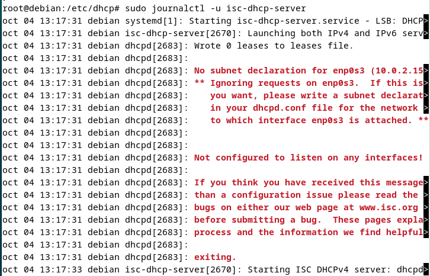

**b.Aplica un filtro para ver solo los logs de un intervalo específico:**

sudo journalctl -u isc-dhcp-server --since "2024-10-04 08:00" --until "2024-10-04 12:00"

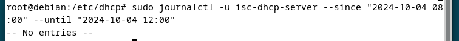

## Conclusión

**Explica el proceso de asignación de IPs y verifica que la configuración se ha aplicado correctamente.**

En este tutorial he configurado con éxito un servidor DHCP en Debian, junto con dos clientes DHCP en Windows y Ubuntu. He aprendido a revisar los parámetros de red, verificar conectividad y observar la actividad del servidor mediante el uso de logs del sistema. Ahora debería poder gestionar redes con DHCP de forma eficiente.


### Edgar Diaz Martinez ASIR2 SRI